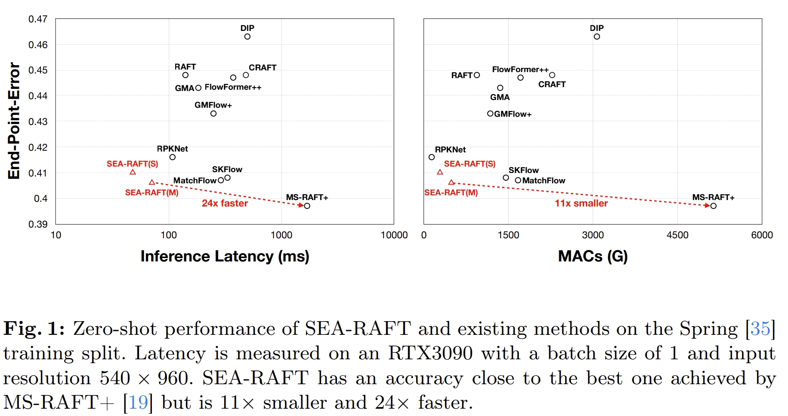
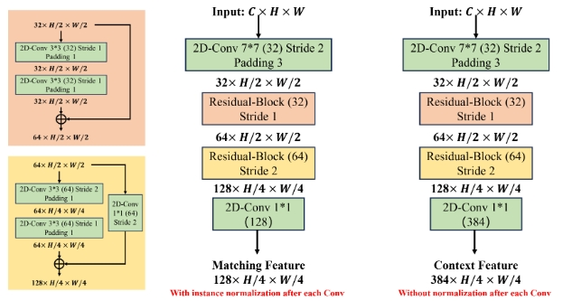

<!-- * 目录
{:toc} -->

# 引言
SEA-RAFT是一种比RAFT更简单、有效、准确率高的光流算法。相比起RAFT，SEA-RAFT训练时用了一种新的loss，即拉普拉斯混合（mixture of Laplace），可以让iterative refinements的时候收敛速度更快。
此外，引入刚体运动（rigid-motion）作为预训练来让系统泛化性更好。

本博客仅供本人学习记录用~

~~~
@inproceedings{wang2024sea,
  title={Sea-raft: Simple, efficient, accurate raft for optical flow},
  author={Wang, Yihan and Lipson, Lahav and Deng, Jia},
  booktitle={European Conference on Computer Vision},
  pages={36--54},
  year={2024},
  organization={Springer}
}
~~~

PS：[RAFT(ECCV20)](https://arxiv.org/pdf/2003.12039)也是来自于Princeton Vision & Learning Lab的，是非常经典的工作了，基于该工作，该团队也相继发表了[DROID-SLAM(NIPUS21)](https://proceedings.neurips.cc/paper/2021/file/89fcd07f20b6785b92134bd6c1d0fa42-Paper.pdf)，[DPVO(NIPUS24)](https://proceedings.neurips.cc/paper_files/paper/2023/file/7ac484b0f1a1719ad5be9aa8c8455fbb-Paper-Conference.pdf)，[DPV-SLAM(ECCV24)](https://arxiv.org/pdf/2408.01654)等系列优秀的工作。而SEA-RAFT则是RAFT的变种，实现更高的效率和准确度。在1080p分辨率下实现21fps的帧率（RTX3090），比RAFT快三倍。

  
<figcaption>  
SEA-RAFT相比起SOTA工作不仅有更高的精度，且延迟和效率都更高。并且超越这些基于RAFT的方法
</figcaption>

# 理论学习
SEA-RAFT相比起主要的贡献点如下：
1. Mixture of Laplace Loss。不再实用标准的L1 loss，SEA-RAFT通过训练网络来估算mixture of Laplace的参数分布，进而最大化真值光流的似然估计。这个新的loss的引入可以减少过拟合以及提升泛化能力.
2. Directly Regressed Initial Flow。原版的RAFT中，在iterative refinement时是把光流初始化为0的，而SEA-RAFT则是通过重用现有的 context encoder并向其提供堆叠的输入帧来预测初始光流，进而实现降低迭代的代数并且提升效率。
3. Rigid-Flow Pre-Training。实际上就是在[TartanAir](https://theairlab.org/tartanair-dataset/)上进行pre-training.
此外，原版的RAFT在feature encoder and context encoder分别采用不同的 normalization layers （如下图所示）以实现稳定的训练，而在SEA-RAFT中均采用标准的ResNet。

  
<figcaption>  
</figcaption>

而对于原版的convolutional GRU也代替为RNN，这也使得SEA-RAFT容易通过增加模块来适用于更大的数据集。

# 参考资料
* [SEA-RAFT ECCV24](https://arxiv.org/pdf/2405.14793)
* [SEA-RAFT Github 仓库](https://github.com/princeton-vl/SEA-RAFT)