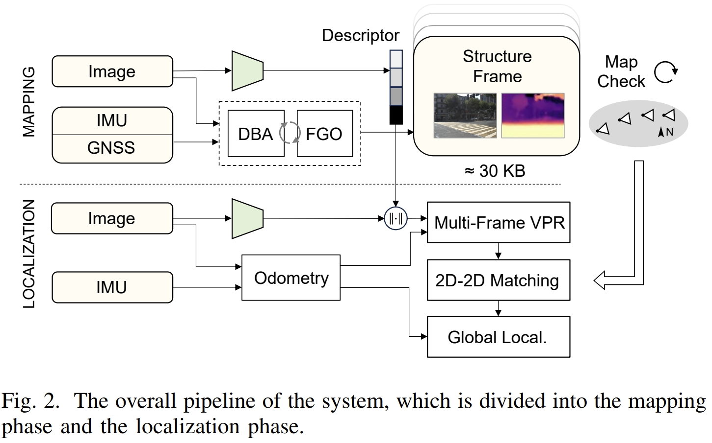
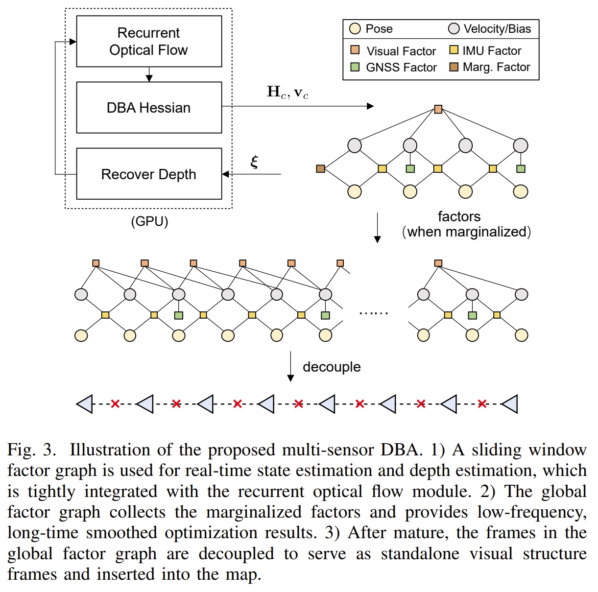
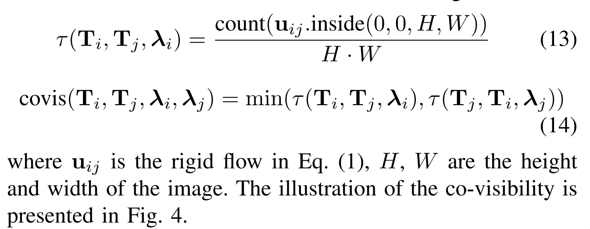
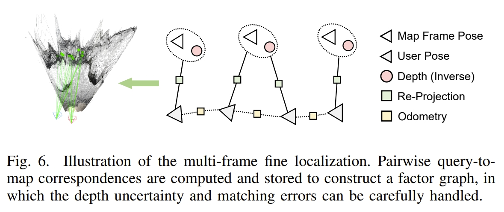
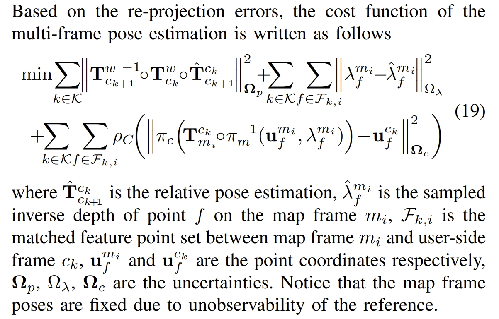

<!-- * 目录
{:toc} -->


# 引言
SF-Loc应该算是[DBA-Fusion(RAL2024)](https://arxiv.org/pdf/2403.13714)的改进版。
在image+IMU的基础上额外加了map-aided localization.而所谓的map属于priori map，是由稀疏帧（每帧为稠密的深度）来组成的。而要实现map-aided localization，就需要分别解决mapping以及re-localization的两个问题。
针对```mapping```，需要考虑的则是建图的效率，地图单元的精度以及存储消耗。通过co-visbility等来保证map的稀疏性，通过紧凑的地图表征，使得每公里的map size降低为3 MB.
至于```re-localization```，首先其是与地图的表征方式紧耦合的，高的回调率（recall）以及高精度就意味着mapping记录的地图信息需要更仔细。作者提出了“visual-structure-frame map representation”它由geo-tagged image frame，compressed RGB map以及full-view depth map组成。
同时通过coarse-to-fine map-aided localization方法，通过集合了基于深度学习的位置识别，局部特征匹配以及时空信息关联。

PS：直观感觉就是在DBA-Fusion的众多约束的基础上加入了map-aided localization的约束。并通过设计相应的地图表征以及coarse-to-fine map-aided localization来实现约束的构建~

~~~
@article{zhou2024sf,
  title={SF-Loc: A Visual Mapping and Geo-Localization System based on Sparse Visual Structure Frames},
  author={Zhou, Yuxuan and Li, Xingxing and Li, Shengyu and Xia, Chunxi and Wang, Xuanbin and Feng, Shaoquan},
  journal={arXiv preprint arXiv:2412.01500},
  year={2024}
}
~~~

# 理论解读

<div align="center">
  
<figcaption>  
SF-Loc的系统框架
</figcaption>
</div>

## Multi-Sensor Dense Bundle Adjustment
这部分应该是跟DBA-Fusion差不多的，如下图所示
<div align="center">
  
<figcaption>  

</figcaption>
</div>


## 地图的构建与维护
在完成了上个session的全局pose优化后，将每帧的pose与对应的RBG图像（用JPEG压缩），低分辨率的深度图，以及由基于深度网络的Visual place recognition (VPR) 模型生成的全局描述子一起打包（感觉也就是把这些信息整合到一块命名为一个类作为一个proposed的地图表征）。
而为了要保证地图是轻量级的，既要保证地图的稀疏性同时也要保证地图可以增量式构建。

为了保证稀疏性，其实也就是通过共视性。而基于视野内的bi-directional dense rigid flow，有效地计算了共视性
<div align="center">
  
  
<figcaption>  
感觉就类似计算前后两帧的光流，原本droid-SLAM或DPVO中判断关键帧就有了
</figcaption>
</div>

## Map-aided localization phase
通过采用轻量级的CNN-based method（此处作者引用了好几篇工作，要看代码才知道具体用的那一个），并设计了对应的 spatially smoothed similarity (SSS)方法来实现帧与map的匹配。

而在匹配后，则相当于完成了coarse estimation，然后通过图优化实现Fine Pose Estimation，如下图所示
<div align="center">
  
  
<figcaption>  
</figcaption>
</div>


# 代码复现及解读
论文的实验效果此处就不再阐述了，因为主要是用作者采集的数据来验证的，且主要验证recall，coarse以及fine re-localization的精度等。还是要仔细阅读才好分析。

接下来直接进行代码复现测试吧，具体配置过程请见：
* [SF-Loc_comment](https://github.com/KwanWaiPang/SF-Loc_comment)


# 参考资料
* [SF-Loc](https://arxiv.org/pdf/2412.01500)
* [SF-Loc Github 仓库](https://github.com/GREAT-WHU/SF-Loc)
* [DBA-Fusion 复现](https://github.com/KwanWaiPang/DBA-Fusion_comment)