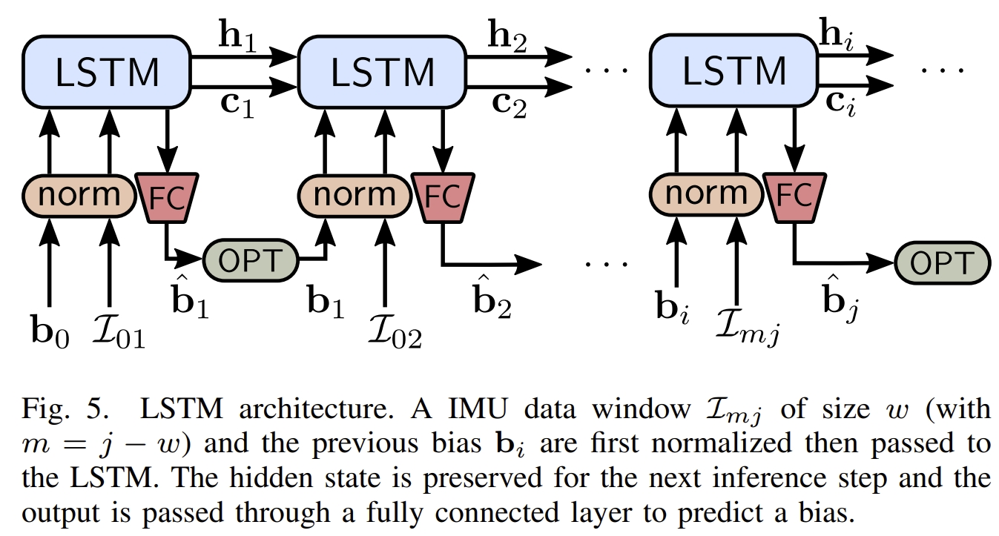
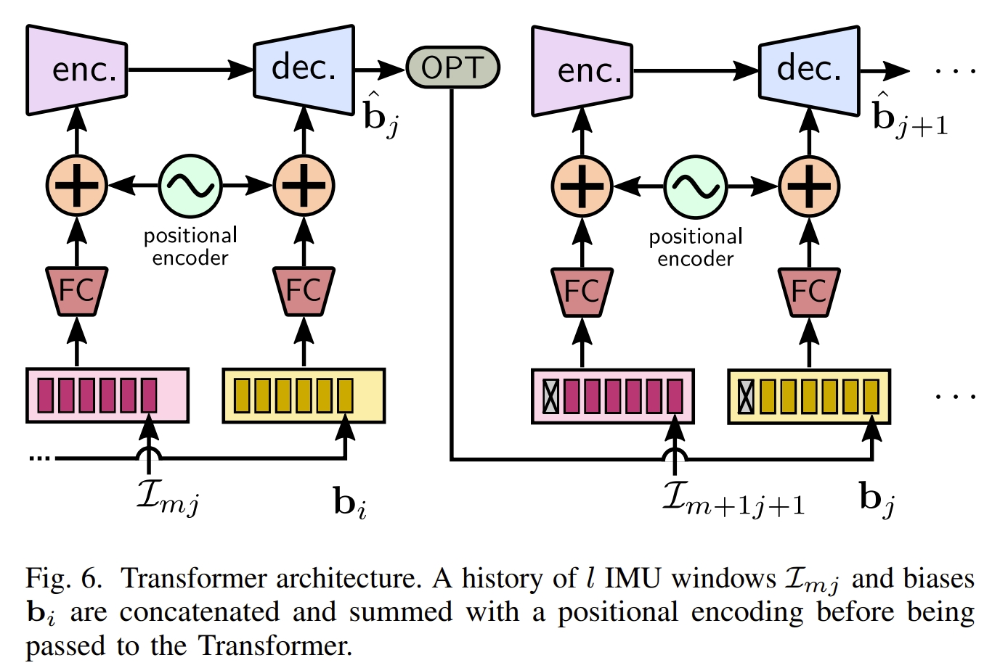

# 引言
对于IMU-based odometry，或者说所有包含IMU的framework，如LIO或VIO，IMU的bias建模是重中之重。
特别是VIO，标定及sensor modeling是影响系统性能最关键的部分。一般传统的方法都是把IMU的bias建模为additive Gaussian noise + random walk.
得益于深度学习强大的性能，基于learning的IMU bias建模也将具备很大的发展潜力。

之前[博客](https://kwanwaipang.github.io/File/Blogs/Poster/Learning_based_VO.html)已经较为系统的介绍了基于learning的VO以及VIO工作。
但是对于使用learning的方法来handle IMU bias仍然没有调研。
为此，写下本博客，作为本人学习相关工作的学习笔记。
本博客仅供本人学习记录用~

* 目录
{:toc}

# Deep IMU Bias Inference for Robust Visual-Inertial Odometry with Factor Graphs
* [RAL 2022](https://arxiv.org/pdf/2211.04517)

该工作实现以及对比了 LSTMs 和 Transformers两个模型对IMU bias的推断性能。
网络不是学习运动模型，而是显示地学习IMU bias，这样也可以使得模型可以泛化到训练中没见过的运行模式。

  <table style="background-color: transparent;">
    <tr>
      <td style="border: none; background-color: transparent;">
        
      </td>
      <td style="border: none; background-color: transparent;">
        
      </td>
    </tr>
  </table>
  <figcaption>
  基于LSTM以及Transformer的IMU-bias Interference结构
  </figcaption>

# AirIMU: Learning uncertainty propagation for inertial odometry
* [code](https://github.com/haleqiu/AirIMU)
* [paper](https://arxiv.org/pdf/2310.04874)

<!-- # 参考资料 -->
